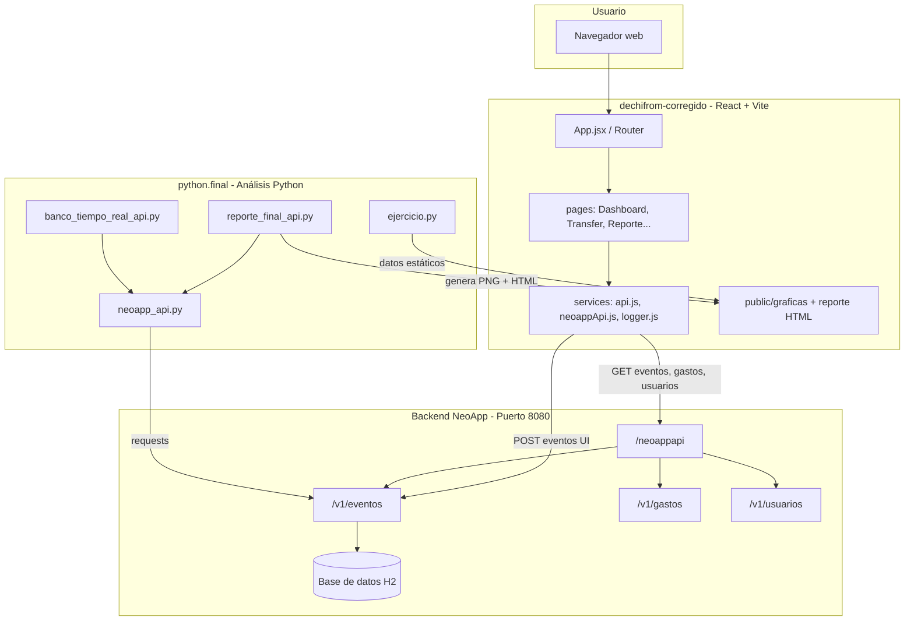

# NovaPay / De-Chill — Ecosistema bancario conectado

Plataforma web de banca simulada (**NovaPay**) integrada con un **backend Java (NeoApp API)** y scripts de **análisis en Python**. Este documento explica **todos los proyectos conectados**, cómo se comunican y cómo ejecutarlos.

---

## Vista general del ecosistema



| Proyecto | Ubicación típica | Tecnología | Rol |
|----------|------------------|------------|-----|
| **dechifrom-corregido** | `Downloads/dechifrom-LISTO/dechifrom-corregido` | React 18 + Vite | App bancaria (login, transferencias, gráficas) |
| **python.final** | `Downloads/python.final/ejercicio practico python` | Python (pandas, matplotlib, plotly) | Reportes, gráficas y dashboard de análisis |
| **NeoApp API** | `http://localhost:8080` | Java / Spring (backend del curso) | API REST + base de datos real |

---

## 1. Proyecto React: `dechifrom-corregido`

Es la aplicación que ves en el explorador de archivos (carpetas `assets`, `components`, `pages`, `services`, etc.).

### Estructura de carpetas

```
dechifrom-corregido/
├── assets/css/          # Estilos globales (index.css, banco.css)
├── components/          # Navbar, componentes reutilizables
├── pages/               # Pantallas de la app
│   ├── Dashboard.jsx    # Inicio: saldo, depósitos, movimientos
│   ├── Transfer.jsx     # Transferencias entre usuarios
│   ├── Payments.jsx     # Pagos / inversiones
│   ├── Ajustes.jsx      # Tema y personalización
│   ├── Login.jsx / Register.jsx
│   └── ReporteGraficas.jsx   # Gráficas del banco + API
├── services/
│   ├── api.js           # Servicios HTTP (gastos → NeoApp)
│   ├── neoappApi.js     # Cliente GET: eventos, gastos, usuarios
│   └── logger.js        # Envía eventos UI al backend (POST)
├── public/
│   ├── graficas/        # PNG generados por Python
│   └── reporte_final_banco.html
├── router/              # Rutas alternativas (si se usan)
├── App.jsx              # Estado global, login, rutas principales
├── Layout.jsx           # Sidebar + menú
├── main.jsx             # Entrada de React
├── vite.config.js       # Build + proxy API + API dev local
├── .env                 # URLs de la API
└── package.json
```

### Cómo funciona la app

1. **Inicio de sesión** (`App.jsx`): valida usuario/PIN contra cuentas en `localStorage` (datos simulados en memoria).
2. **Navegación** (`Layout.jsx` + React Router):
   - `/` → Dashboard  
   - `/transferir` → Transferencias  
   - `/pagar` → Pagos  
   - `/ajustes` → Ajustes  
   - `/reporte` → **Reporte y gráficas del banco**
3. **Registro de actividad** (`logger.js`): cada clic, login, transferencia, etc. se envía como evento al backend:
   - `POST` → `http://localhost:8080/neoappapi/v1/eventos`
   - También guarda en `/api/events` (servidor de desarrollo Vite, solo local).
4. **Consulta de datos** (`neoappApi.js`):
   - `GET /neoappapi/v1/eventos` → lista de eventos (clicks, HTTP, UI…)
   - `GET /neoappapi/v1/gastos` → gastos registrados
   - `GET /neoappapi/v1/usuarios` → usuarios del sistema
5. **Página de gráficas** (`ReporteGraficas.jsx`):
   - Muestra las 4 imágenes en `public/graficas/`
   - Barras en vivo con datos de la API (actualización cada 8 s)
   - Enlace al reporte HTML completo

### Proxy de desarrollo (Vite)

En `vite.config.js`, las peticiones a `/neoappapi` se redirigen a `http://localhost:8080` para evitar problemas de CORS:

```
Navegador  →  http://localhost:5173/neoappapi/v1/eventos
Vite proxy →  http://localhost:8080/neoappapi/v1/eventos
```

### Variables de entorno (`.env`)

```env
VITE_NEOAPP_API_BASE=/neoappapi
VITE_BACKEND_EVENTS_URL=http://localhost:8080/neoappapi/v1/eventos
```

| Variable | Uso |
|----------|-----|
| `VITE_NEOAPP_API_BASE` | Base para GET (eventos, gastos, usuarios) vía proxy |
| `VITE_BACKEND_EVENTS_URL` | URL donde el frontend hace POST de eventos de UI |

### Comandos React

```powershell
cd "ruta\dechifrom-corregido"
npm install
npm run dev      # http://localhost:5173
npm run build    # genera carpeta dist/
npm run preview  # previsualizar build
```

**Requisito:** el backend NeoApp debe estar corriendo en el puerto **8080** para gráficas en vivo y registro de eventos.

---

## 2. Backend NeoApp API (Java — puerto 8080)

No está dentro de esta carpeta React, pero es el **centro** que conecta todo. Lo levantas por separado (proyecto Java del curso / NeoApp).

### Endpoints principales

| Método | URL | Estado habitual | Descripción |
|--------|-----|-----------------|-------------|
| GET | `http://localhost:8080/neoappapi/v1/eventos` | ✅ 200 | Todos los eventos (UI, HTTP, clicks…) |
| POST | `http://localhost:8080/neoappapi/v1/eventos` | ✅ | Crear evento desde el frontend |
| GET | `http://localhost:8080/neoappapi/v1/gastos` | ✅ 200 | Lista de gastos (puede estar vacía) |
| GET | `http://localhost:8080/neoappapi/v1/usuarios` | ✅ 200 | Usuarios registrados |
| GET | `http://localhost:8080/neoappapi` | ⚠️ 500 | Raíz; no usar como fuente de datos |

### Formato de un evento (ejemplo)

```json
{
  "id": 401,
  "accion": "ui:click",
  "detalle": "{\"path\":\"/\",\"text\":\"OK\"}",
  "fechaEvento": "2026-05-25T11:40:24.715",
  "tipo": "UI",
  "origen": "FRONTEND_BANK",
  "ruta": "/",
  "metodoHttp": "POST",
  "usuario": "frontend"
}
```

**Flujo:** el usuario usa NovaPay → `logger.js` hace POST → el backend guarda en H2 → Python y la página `/reporte` leen esos mismos datos con GET.

---

## 3. Proyecto Python: `python.final`

Carpeta: `Downloads/python.final/ejercicio practico python`

Scripts de **análisis de datos** y **entregable del proyecto integrador** (Matplotlib, Plotly, reporte HTML).

### Archivos principales

| Archivo | Función |
|---------|---------|
| `neoapp_api.py` | Cliente HTTP (misma API que React) |
| `ejercicio.py` | Reporte histórico estático → PNG, HTML, PDF |
| `reporte_final_api.py` | **Entregable:** API + Matplotlib + Plotly → carpeta `entregable/` |
| `banco_tiempo_real_api.py` | Dashboard animado en tiempo real (matplotlib) |
| `mostrar_graficas_banco.py` | Abre ventanas con gráficas históricas + API |
| `probar_conexion.py` | Prueba rápida de conexión a la API |
| `requirements.txt` | Dependencias Python |

### Carpeta `entregable/` (salida del reporte final)

```
entregable/
├── reporte_final_banco.html    # Reporte HTML completo (Plotly embebido)
├── Reporte_Final_Banco.pdf
├── grafico_evolucion_banco.png
├── grafico_promedios_banco.png
├── grafico_api_tipos.png
├── grafico_api_origenes.png
└── datos_reporte.json
```

Esos PNG y el HTML se **copian** a `dechifrom-corregido/public/` para mostrarlos en la app React.

### Comandos Python

```powershell
cd "ruta\ejercicio practico python"
pip install -r requirements.txt

python probar_conexion.py          # verificar API
python reporte_final_api.py        # generar entregable/
python mostrar_graficas_banco.py   # ver gráficas en ventanas
python banco_tiempo_real_api.py    # dashboard en vivo (matplotlib)
python ejercicio.py                # reporte histórico clásico
```

Variables opcionales:

```powershell
$env:NEOAPP_API_BASE="http://localhost:8080/neoappapi"
$env:NEOAPP_API_EVENTOS="http://localhost:8080/neoappapi/v1/eventos"
```

---

## 4. Cómo se conectan los tres proyectos

```
┌─────────────────────────────────────────────────────────────────┐
│  1. Usuario opera NovaPay (React)                               │
│     → login, transferir, clics, depósitos                       │
└────────────────────────────┬────────────────────────────────────┘
                             │ POST /v1/eventos (logger.js)
                             ▼
┌─────────────────────────────────────────────────────────────────┐
│  2. Backend NeoApp :8080                                        │
│     → guarda eventos, gastos, usuarios en base de datos        │
└────────────┬───────────────────────────────┬────────────────────┘
             │ GET /v1/eventos              │ GET /v1/gastos, usuarios
             ▼                               ▼
┌────────────────────────────┐   ┌────────────────────────────────┐
│  3a. React /reporte        │   │  3b. Python reporte_final_api  │
│      neoappApi.js          │   │      neoapp_api.py             │
│      Gráficas en vivo      │   │      PNG + HTML + PDF          │
└────────────────────────────┘   └────────────────────────────────┘
             │                               │
             └───────────┬───────────────────┘
                         ▼
              public/graficas/*.png
              public/reporte_final_banco.html
```

### Orden recomendado para trabajar

1. **Iniciar backend Java** en puerto `8080`.
2. **Generar reportes Python** (opcional, actualiza imágenes):
   ```powershell
   python reporte_final_api.py
   ```
   Copiar de nuevo a React si cambiaste rutas:
   ```powershell
   Copy-Item "entregable\*.png" "..\..\dechifrom-LISTO\dechifrom-corregido\public\graficas\"
   Copy-Item "entregable\reporte_final_banco.html" "..\..\dechifrom-LISTO\dechifrom-corregido\public\"
   ```
3. **Iniciar React:**
   ```powershell
   npm run dev
   ```
4. Iniciar sesión y abrir **Reporte y Gráficas** en el menú lateral.

---

## 5. Rutas de la aplicación React

| Ruta | Página | Descripción |
|------|--------|-------------|
| `/login` | Login | Acceso con usuario y PIN |
| `/registro` | Register | Crear cuenta local |
| `/` | Dashboard | Saldo y movimientos |
| `/transferir` | Transfer | Enviar dinero a otro usuario |
| `/pagar` | Payments | Pagos / inversiones |
| `/ajustes` | Ajustes | Personalización |
| `/reporte` | ReporteGraficas | **Gráficas + datos API** |

---

## 6. Servicios del frontend (detalle)

### `services/logger.js`

- Registra acciones del usuario (`login:success`, `ui:click`, `transfer:user:success`, etc.).
- Envía **POST** al backend NeoApp con campos: `accion`, `detalle`, `tipo`, `origen`, `ruta`, `usuario`, `fechaEvento`.
- No bloquea la app si el backend no responde.

### `services/neoappApi.js`

- **Solo lectura (GET):** eventos, gastos, usuarios.
- Normaliza eventos para tablas y gráficas en `/reporte`.
- `verificarApi()` comprueba que los endpoints respondan.

### `services/api.js`

- `gastosService.getAll()` intenta primero NeoApp; si falla, usa jsonplaceholder como respaldo.
- Centraliza cabeceras y token simulado en `localStorage`.

---

## 7. Entregable proyecto integrador

Requisitos del curso cubiertos por:

| Requisito | Dónde se cumple |
|-----------|-----------------|
| Consumir API real | React (`neoappApi.js`) + Python (`neoapp_api.py`) |
| Matplotlib | `ejercicio.py`, `reporte_final_api.py`, `banco_tiempo_real_api.py` |
| Plotly | `reporte_final_api.py` → HTML en `entregable/` y `public/` |
| Reporte HTML | `public/reporte_final_banco.html` y página `/reporte` |
| Visualización en app | `pages/ReporteGraficas.jsx` |

---

## 8. Solución de problemas

| Problema | Causa probable | Solución |
|----------|---------------|----------|
| Gráficas en vivo vacías | Backend apagado | Iniciar NeoApp en :8080 |
| Error CORS en desarrollo | Petición directa a :8080 | Usar `npm run dev` (proxy `/neoappapi`) |
| `GET /neoappapi` → 500 | Endpoint raíz no válido | Usar `/v1/eventos`, no la raíz |
| PNG no se ven en React | Archivos no copiados | Ejecutar `reporte_final_api.py` y copiar a `public/graficas/` |
| Python no encuentra `python` | PATH | Usar ruta completa: `C:\Users\...\Python311\python.exe` |
| Eventos duplicados en dashboard Python | Polling sin filtro por ID | Ya corregido en `banco_tiempo_real_api.py` (IDs vistos) |

---

## 9. Equipo y historias de usuario (referencia curso)

| Integrante | Rol |
|------------|-----|
| Juan Camilo Hernandez Orrego | UI/UX, repositorio |
| Emmanuel perez quintero | Frontend, Git |
| Isabela rodriguez | Backend |
| Jeronimo escobar | QA, documentación |

Historias implementadas en la app: login (HU-04), registro (HU-03), movimientos y transferencias, registro de eventos al backend, panel de gráficas y métricas (HU-06 / análisis de datos).

---

## 10. Resumen en una frase

**NovaPay (React)** registra y muestra la actividad del banco; **NeoApp (Java :8080)** persiste los datos; **Python** genera el reporte académico con gráficas; todo se une en la ruta **`/reporte`** y en **`public/graficas/`**.

---

*Última actualización: integración API NeoApp, página ReporteGraficas, proxy Vite y documentación del ecosistema completo.*
